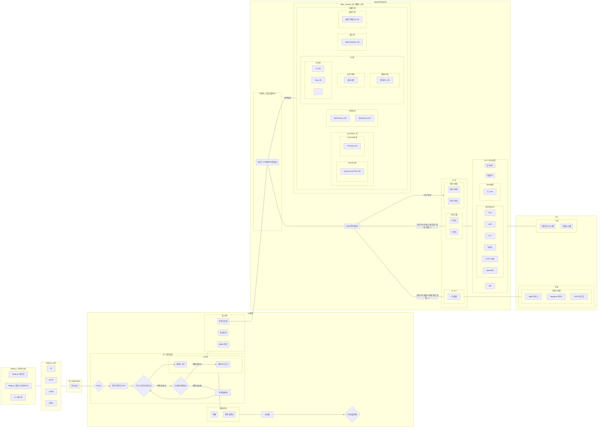

# 기본사항

이 프로젝트는 Node.js Design Pattern 3rd 내용을 기반으로 합니다. \
책의 실습환경을 가능한 최신 버전에 맞게 수정하였으며 초기설정은 저의 다른 프로젝트인 [ts-yarn2-sterter 프로젝트](https://github.에com/codelab-kr/ts-yarn2-starter) 를 참고하시기 바랍니다.

- Node.js v21.1.0
- yarn v4.0.2
- typescript ^5.3.0

 

# Node.js

